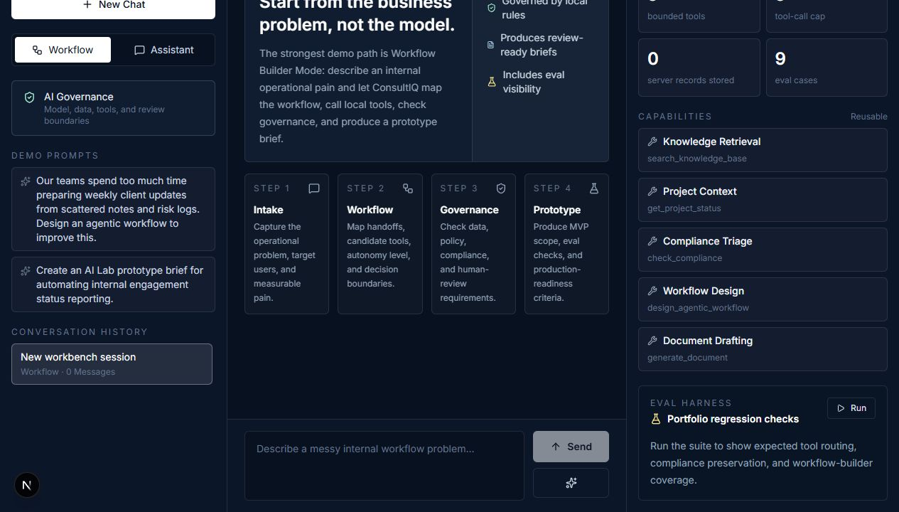
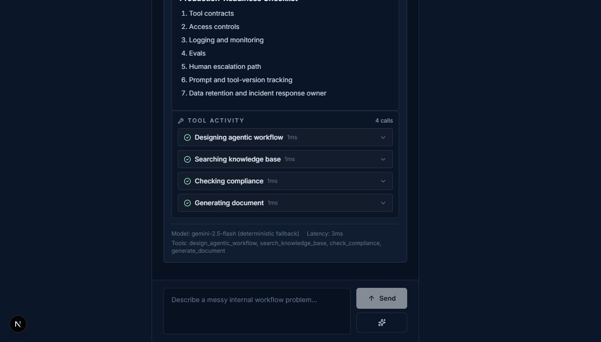
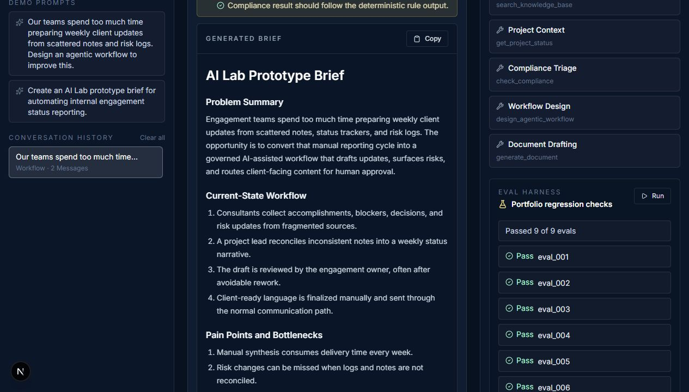
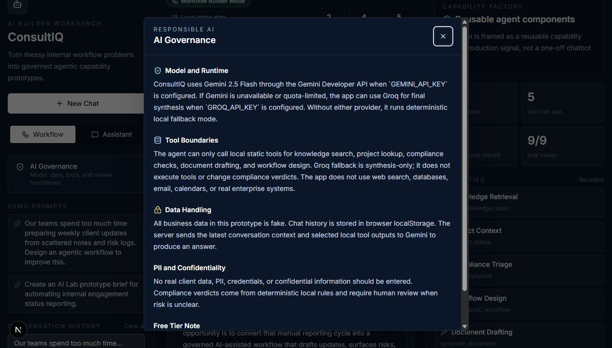

# ConsultIQ: AI Builder Workbench

ConsultIQ is a full-stack portfolio prototype that demonstrates how an enterprise AI Lab could turn messy internal workflow problems into governed, reusable agentic capabilities.

It is designed for an AI Builder / AI Solutions Designer role: the emphasis is not just chat, but workflow redesign, tool use, compliance boundaries, human review, and production-readiness thinking.

## Why I Built This

Most AI portfolio demos are chatbots with a prompt. That misses what enterprise AI actually needs: bounded workflows, governance, tool orchestration, human gates, fallback behavior, and a clear path from prototype to production.

I started from the question: _what would an AI Lab inside a consulting firm actually need to take a messy internal problem and turn it into a governed agentic capability?_ That led to five design decisions that shaped everything:

1. **Workflow-first, not chat-first.** The strongest mode is Workflow Builder: you describe a business pain, and ConsultIQ produces a structured AI Lab Prototype Brief with current-state analysis, proposed agentic workflow, tool requirements, compliance checks, human gates, MVP scope, and production-readiness criteria. The model is a synthesis layer on top of deterministic tools — not the source of truth.

2. **Compliance verdicts are deterministic.** The `check_compliance` tool returns allowed, review required, or not allowed from local static rules. The model can explain the verdict, but it cannot override it. This is enforced in code: `enforceComplianceVerdict()` rewrites the model output if it drifts from the tool result. In a real firm, compliance cannot be a suggestion.

3. **Graceful degradation.** The app works at three levels: Gemini function calling → Groq synthesis fallback → deterministic local demo. If the API key is missing or quota-limited, the prototype still runs. This isn't just resilience — it means a reviewer can evaluate the project without needing credentials.

4. **Reusable capabilities, not one-off features.** The Capability Factory panel frames each tool as a reusable internal capability with a production signal — what would need to be true for this tool to go from prototype to production. Each build starts further ahead because components are designed for the shared stack.

5. **Eval visibility.** The eval harness calls the real tool layer, validates tool routing, compliance verdicts, and workflow sections, then surfaces pass/fail in the UI. It is not a test suite that tests itself — it runs tools against eval cases and checks actual outputs.

## What This Proves For An AI Builder Role

| Signal | Where to look |
|---|---|
| Thinks in workflows, not just models | Workflow Builder Mode → 11-section AI Lab Prototype Brief |
| Builds and hardens tools | 5 bounded tools with deterministic local execution, fallback chain |
| Treats governance as a design constraint | Compliance verdicts are code-enforced, not model-suggested |
| Designs human-in-the-loop gates | Human-review flags, engagement-owner approval points |
| Contributes reusable capabilities | Capability Factory panel with production signals |
| Designs evaluations | Eval harness with tool routing, verdict, and section checks |
| Takes end-to-end ownership | From problem framing through working prototype with deployment |
| Comfortable with ambiguity | Graceful degradation across 3 provider tiers |

## Screenshots

First-run workflow workbench:



Generated prototype brief with local tool activity:



Deterministic eval panel:



Governance modal:



## Business Problem

Large professional services teams often have operational pain hidden inside repeatable workflows: status reporting, project risk summaries, policy interpretation, onboarding, approval routing, and prototype intake.

The challenge is not simply asking an LLM a question. The challenge is turning a messy business problem into a bounded agentic workflow that can be tested, governed, reused, and eventually industrialized.

ConsultIQ demonstrates that lifecycle in a compact prototype.

## Why This Is More Than A Chatbot

ConsultIQ has two modes:

- **Assistant Mode:** an internal consulting assistant for policies, project status, compliance checks, and document drafts.
- **Workflow Builder Mode:** a guided AI Builder workflow that maps a messy internal problem into an agentic workflow proposal, risk assessment, MVP scope, evaluation checklist, and production-readiness checklist.

The app shows tool activity, local tool results, compliance flags, human-review warnings, token estimates, latency, and governance metadata.

It also includes a **Capability Factory** panel that frames each tool as a reusable internal capability, plus an eval harness that calls real tools and validates outputs for portfolio demo scenarios.

## Architecture

```text
Browser
  |
  | chat message + selected local history
  v
Next.js App Router UI
  |
  | POST /api/chat (rate-limited, size-capped, role-sanitized)
  v
Agentic Loop in Next.js API Route
  |
  | Gemini function calling, max 5 tool calls
  v
Local Tool Layer
  |-- search_knowledge_base       -> app/data/knowledge-base.json
  |-- get_project_status          -> app/data/projects.json
  |-- check_compliance            -> app/data/compliance-rules.json
  |-- design_agentic_workflow     -> app/data/workflow-patterns.json
  |-- generate_document           -> deterministic markdown draft
  |
  v
Gemini 2.5 Flash final response
  |
  | if Gemini is unavailable or quota-limited
  v
Groq synthesis fallback using already-executed local tool results
  |
  | if no provider is available
  v
Deterministic local fallback
  |
  v
Structured UI response with tool events, flags, and metadata

GET /api/evals
  |
  v
Portfolio eval suite (calls real tools)
  |-- tool routing validation
  |-- compliance verdict validation
  |-- workflow section validation
```

## Agent Loop

The backend uses Gemini function calling through `@google/genai`.

1. Receive the latest conversation and selected mode.
2. Send the prompt to Gemini with tool declarations.
3. If Gemini requests tools, execute deterministic local handlers.
4. Send function responses back to Gemini.
5. Repeat up to five tool calls.
6. Return the final assistant answer with tool event metadata.

If `GEMINI_API_KEY` is missing, the app still runs in demo mode with local deterministic behavior so the portfolio can be reviewed without a paid API call.

If `GROQ_API_KEY` is configured, Groq is used as a synthesis fallback when Gemini is unavailable or quota-limited. Local tools still run deterministically; Groq only writes the final answer from the local tool results.

Non-quota provider errors are surfaced in the response metadata for observability, rather than silently hidden behind fallback behavior.

## Tools

- `search_knowledge_base(query)` searches fake enterprise policies and delivery guidance.
- `get_project_status(project_id)` returns fake project metadata for consulting engagements.
- `check_compliance(action)` deterministically returns `allowed`, `review required`, or `not allowed`.
- `generate_document(type, context)` produces markdown drafts for status updates, risk summaries, meeting agendas, client briefs, and AI Lab prototype briefs.
- `design_agentic_workflow(problem)` maps a messy problem to local workflow patterns, human gates, autonomy level, and eval criteria.

## API Guardrails

The `/api/chat` endpoint includes:

- **Rate limiting**: 20 requests per 60 seconds per IP (in-memory; production would use Redis).
- **Body size cap**: 100KB maximum request size.
- **Message count cap**: 30 messages per request.
- **Content length cap**: 4,000 characters per message.
- **Role sanitization**: Only `user` and `assistant` roles are accepted.

## Responsible AI Controls

- Fake data only; no real firm, client, or proprietary records.
- No database or persistent server storage.
- Chat history is stored only in browser `localStorage`.
- Server sends the conversation context and selected local tool outputs to Gemini.
- Compliance verdicts are deterministic and cannot be overridden by the model.
- Human-review-required outputs are visually flagged.
- The AI Governance modal explains model, data, tool, privacy, and quota boundaries.

## Demo Scenarios

For the **strongest demo path**, use Workflow Builder mode and try:

1. _Our teams spend too much time preparing weekly client updates from scattered notes and risk logs. Design an agentic workflow to improve this._
2. _Create an AI Lab prototype brief for automating internal engagement status reporting._

For Assistant mode:

3. _What is our policy on using AI tools with client data?_
4. _Give me a status update on Project Northstar._
5. _Draft a risk summary for a client migration engagement._
6. _Is it compliant to share a client's financial data with a third-party vendor for analysis?_

## Evaluation Strategy

The prototype includes `app/data/eval-cases.json` with 9 deterministic tool-plan regression cases. The eval harness (`/api/evals`):

1. Calls the shared deterministic tool-plan helper and real local tool layer with each eval prompt.
2. Validates tool routing: were the expected tools actually called?
3. Validates compliance verdicts: does the deterministic output match the expected verdict?
4. Validates workflow sections: does the workflow tool output include required sections and a recommended pattern?
5. Validates unknown-project guardrails so the app does not invent project facts.
6. Reports per-check pass/fail with detailed reasoning.

This is intentionally not presented as a full nondeterministic LLM quality evaluation. It is the first production-readiness layer: deterministic regression checks for tool routing, compliance, and structured workflow outputs.

The UI exposes these results in the Capability Factory panel with a "Run" button.

## Local Setup

```bash
cp .env.local.example .env.local
# Fill in your API keys in .env.local
npm install
npm run dev
```

Open `http://localhost:3000`.

Without provider keys, ConsultIQ runs in local deterministic demo mode.

## Verification

```bash
npm run typecheck
npm run lint
npm run test
npm run build
npm run security:audit
npm run security:secrets
```

`security:secrets` scans commit candidates for obvious provider keys and private-key markers. Rotate local provider keys before publishing if they have ever been shared outside this machine.

## Deployment

The app is designed for Vercel.

1. Push the repository to GitHub.
2. Import the project into Vercel.
3. Add `GEMINI_API_KEY` as an environment variable.
4. Optionally add `GROQ_API_KEY` for synthesis fallback.
5. Deploy.

Live demo: pending Vercel deployment. Replace this line with the deployed URL before submitting the application.

## Design Write-Up

See [`DESIGN.md`](DESIGN.md) for the decision narrative behind the workflow-first UX, deterministic compliance tool, fallback chain, and eval strategy.

## License

MIT. See [`LICENSE`](LICENSE).

## What I Would Improve In Production

- Add streaming responses so tool calls appear in real time.
- Add authentication and role-based access controls.
- Replace static JSON with approved enterprise data connectors.
- Add audit logging and prompt/version tracking.
- Expand the eval harness into automated CI-gated regression tests with saved golden outputs.
- Add observability dashboards for tool latency, failure rates, and user feedback.
- Add approval workflows for client-facing drafts.
- Add data-retention controls and incident response ownership.
- Add persistent rate limiting via Redis and abuse detection.
- Add end-to-end browser tests for critical user flows.
