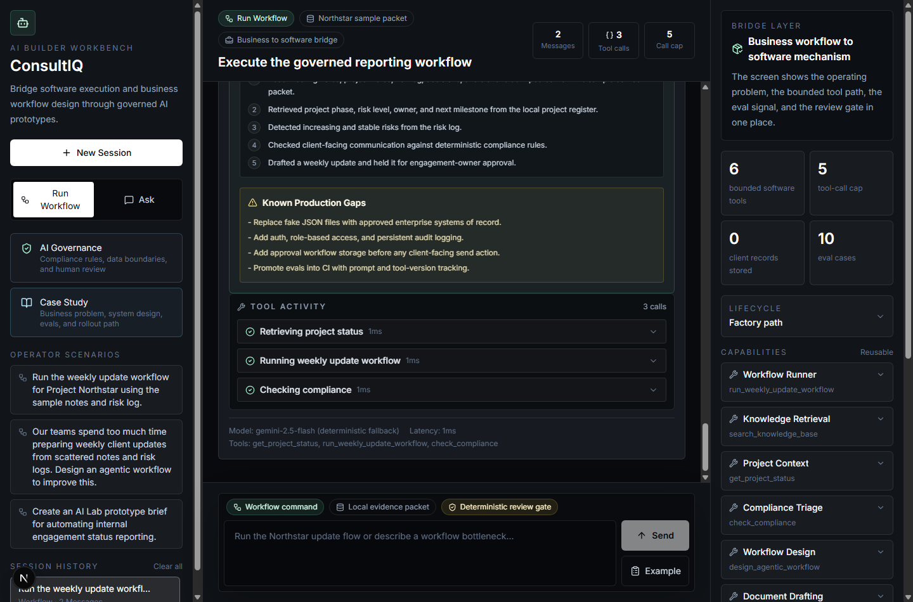
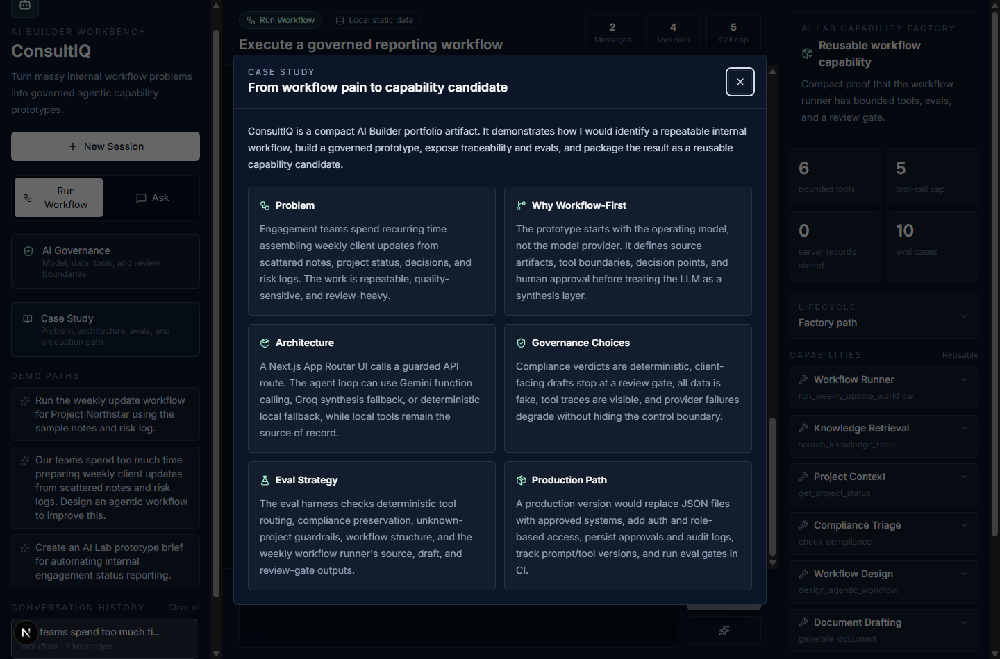

# ConsultIQ: AI Builder Workbench

ConsultIQ is a portfolio prototype for an AI Builder / AI Lab capability factory. It shows how a messy internal workflow can become a governed, reusable agentic capability with bounded tools, evals, review gates, fallback behavior, and a production path.

Live demo: [https://consultiq.vercel.app/](https://consultiq.vercel.app/)

## Reviewer Path

1. Open the live demo.
2. Click **Run weekly update workflow**.
3. Inspect the workflow run card: source notes, risk log, project facts, generated update, and review gate.
4. Expand **Tool Activity** to see deterministic tool calls.
5. Review the **Capability Candidate Packet** and audit trace.
6. Open **Case Study** for the build story.
7. Run the eval suite from the right panel.
8. Try **Run 90-second reviewer path** or the Gemini Enterprise adoption-readiness prompt.

## What To Notice

- **This executes a workflow, not just a prompt.** The weekly update runner reads fake project notes, reads a fake risk log, pulls project status, detects risks, drafts a weekly update, and flags human review before client-facing use.
- **The model is not the system of record.** Project facts, compliance verdicts, workflow patterns, and document contracts come from deterministic local tools.
- **The output is productized.** The workflow run becomes a Capability Candidate Packet with business value, governance, eval coverage, known gaps, and production-readiness signals.
- **Ownership is explicit before handoff.** The packet names the business owner, technical owner, reviewer, measurable success metric, and condition for moving beyond prototype.
- **The app shows a second AI adoption scenario.** A Gemini Enterprise adoption-readiness prompt demonstrates use case intake, data sensitivity, adoption risk, measurable outcome, and rollout recommendation thinking.
- **Fallback behavior is visible but not scary.** If Gemini is unavailable, the footer explains the provider path in plain language, for example: local tools ran, then Groq wrote the final answer.
- **The app is reviewable without credentials.** Gemini, Groq, and deterministic local demo paths let the portfolio keep working during provider quota or key issues.

## Screenshots

First-run workflow workbench:


Executed weekly update workflow:



Generated prototype brief with tool activity:


Case study modal:



Deterministic eval panel:


AI governance modal:


## Why This Is More Than A Chatbot

ConsultIQ has two paths:

- **Run Workflow:** executes the Project Northstar weekly reporting workflow from fake source artifacts.
- **Ask ConsultIQ:** answers policy, project, compliance, and drafting questions with local tools.

The stronger portfolio path is **Run Workflow** because it demonstrates workflow thinking: source collection, tool orchestration, risk detection, compliance checks, draft generation, and a human approval boundary.

The second reviewer path is **Gemini Enterprise Adoption Readiness**. It shows how the same workbench pattern can evaluate AI adoption ideas before a team builds the wrong prototype: name an accountable owner, classify data sensitivity, define a measurable outcome, keep human review, and recommend prototype/pilot/defer.

## Architecture

```text
Browser
  |
  v
Next.js App Router UI
  |
  | POST /api/chat
  v
Agent loop
  |
  | bounded tool calls
  v
Local deterministic tools
  |-- run_weekly_update_workflow
  |-- search_knowledge_base
  |-- get_project_status
  |-- check_compliance
  |-- design_agentic_workflow
  |-- generate_document
  |
  v
Provider path
  |-- Gemini function calling and synthesis
  |-- Groq synthesis fallback from local tool results
  |-- deterministic local demo fallback
  |
  v
Structured UI response with tool events, flags, and metadata
```

## Local Setup

```bash
cp .env.local.example .env.local
npm install
npm run dev
```

Open `http://localhost:3000`.

Provider keys are optional for review. Without keys, ConsultIQ uses deterministic local demo behavior.

## Verification

```bash
npm run typecheck
npm run lint
npm run test
npm run build
npm run security:audit
npm run security:secrets
```

The eval suite contains 11 deterministic cases, including weekly workflow ownership/handoff checks and a Gemini Enterprise adoption-readiness workflow case.

## Design Notes

[`DESIGN.md`](DESIGN.md) explains the technical choices: workflow-first UX, deterministic tools, code-enforced compliance, provider fallback wording, eval strategy, and the production path.

## License

MIT. See [`LICENSE`](LICENSE).
